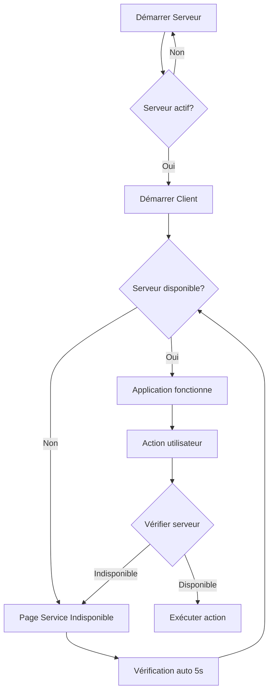

# 🚀 Guide de Lancement - Séparation Client/Serveur

## Architecture

L'application Annuaire INF1010 est maintenant séparée en deux composants :

### 🖥️ **SERVEUR** 
- Gère la logique métier et les connexions à la base de données
- Accepte plusieurs clients simultanément
- Doit être démarré en premier

### 💻 **CLIENT**
- Interface graphique JavaFX
- Se connecte au serveur pour effectuer les opérations
- Vérifie automatiquement la disponibilité du serveur

---

## 📋 Prérequis

- **Java 17** ou supérieur
- **Maven** installé et dans le PATH
- **Base de données MySQL** accessible (Railway)

---

## 🎯 Démarrage de l'Application

### Étape 1 : Démarrer le SERVEUR

#### Sur macOS/Linux :
```bash
./start-server.sh
```

#### Sur Windows :
```cmd
start-server.bat
```

#### Ou manuellement avec Maven :
```bash
mvn clean compile
mvn exec:java -Dexec.mainClass="com.example.demo.server.ServerLauncher"
```

**⚠️ Important :**
- Le serveur trouvera automatiquement un port disponible (à partir de 445)
- Le port sera sauvegardé dans `port.txt`
- **Ne fermez pas la fenêtre du serveur** tant que vous utilisez l'application

**Sortie attendue :**
```
═══════════════════════════════════════════════════════
   🚀 DÉMARRAGE DU SERVEUR ANNUAIRE INF1010
═══════════════════════════════════════════════════════
[SERVER] Serveur en écoute sur le port 445
[SERVER] Port sauvegardé dans port.txt : 445
[SERVER] ouvert attend nouvelle connection cliente ...
```

---

### Étape 2 : Démarrer le CLIENT

**Dans un nouveau terminal/fenêtre de commande :**

#### Sur macOS/Linux :
```bash
./start-client.sh
```

#### Sur Windows :
```cmd
start-client.bat
```

#### Ou manuellement avec Maven :
```bash
mvn javafx:run
```

**Comportement du client :**
- ✅ Si le serveur est accessible → L'application fonctionne normalement
- ❌ Si le serveur n'est pas accessible → Page "Service Indisponible" s'affiche

---

## 🔧 Validation de la Connexion Serveur

### Vérification Automatique

À chaque action dans l'interface client :
1. ✅ **Vérification** : Le client vérifie si le serveur est disponible
2. ✅ **Action** : Si disponible, l'action est exécutée
3. ❌ **Redirection** : Si indisponible, redirection vers la page d'erreur

### Page "Service Indisponible"

Lorsque le serveur n'est pas accessible, vous verrez :

- **⚠️ Message d'erreur** clair
- **🔄 Vérification automatique** toutes les 5 secondes
- **🔄 Bouton "Réessayer"** pour tenter manuellement
- **💡 Conseils de dépannage**
- **❌ Bouton "Quitter"**

---

## 🎮 Fonctionnalités avec Validation Serveur

Toutes ces actions vérifient la disponibilité du serveur avant de s'exécuter :

- 📋 Lister les membres
- 👨‍🏫 Lister les professeurs par domaine
- 🔍 Rechercher un membre
- ➕ Ajouter un membre
- 🚫 Gérer la liste rouge
- 👥 Voir les utilisateurs connectés

---

## 🐛 Dépannage

### Le serveur ne démarre pas

**Problème** : Port déjà utilisé
```
Port 445 occupé, essai du suivant...
```
**Solution** : Normal, le serveur trouvera automatiquement un port libre

---

**Problème** : Erreur de compilation
```
❌ Erreur lors de la compilation
```
**Solution** :
```bash
mvn clean install
```

---

### Le client ne se connecte pas

**Problème** : Serveur indisponible
```
[CLIENT] ❌ Impossible de se connecter au serveur
```

**Solutions** :
1. ✅ Vérifiez que le serveur est démarré
2. ✅ Vérifiez que le fichier `port.txt` existe
3. ✅ Redémarrez le serveur
4. ✅ Utilisez le bouton "Réessayer" dans l'interface

---

**Problème** : Fichier port.txt manquant
```
⚠️ ATTENTION: Le fichier port.txt n'existe pas
```

**Solution** : Démarrez le serveur au moins une fois pour créer ce fichier

---

### Erreur de connexion en cours d'utilisation

**Comportement** :
- L'application détecte automatiquement la perte de connexion
- Redirige vers la page "Service Indisponible"
- Tente de se reconnecter automatiquement toutes les 5 secondes

**Actions** :
1. Vérifiez que le serveur fonctionne toujours
2. Cliquez sur "Réessayer" pour forcer une reconnexion

---

## 📊 Architecture des Composants

### Structure des Packages

```
com.example.demo
├── client/                    # ✨ NOUVEAU
│   └── ServerConnectionManager.java  # Gestion connexion serveur
├── server/
│   ├── Server.java           # Serveur principal
│   ├── ServerLauncher.java   # ✨ NOUVEAU - Point d'entrée serveur
│   └── GestionnaireClient.java
├── util/
│   └── ServerValidator.java  # ✨ NOUVEAU - Validation connexion
└── ServiceIndisponibleController.java  # ✨ NOUVEAU - Page erreur
```

### Nouveaux Fichiers

1. **ServerLauncher.java** : Point d'entrée dédié pour le serveur
2. **ServerConnectionManager.java** : Gestionnaire de connexion client/serveur
3. **ServerValidator.java** : Utilitaire de validation de connexion
4. **ServiceIndisponibleController.java** : Contrôleur pour la page d'erreur
5. **service-indisponible.fxml** : Interface de la page d'erreur
6. **start-server.sh/bat** : Scripts de lancement du serveur
7. **start-client.sh/bat** : Scripts de lancement du client

---

## 🎯 Workflow d'Utilisation



---

## 🔒 Sécurité et Robustesse

### Timeouts
- **Connexion** : 3 secondes
- **Tentatives** : Maximum 3 essais

### Validation
- ✅ Vérification avant chaque action
- ✅ Ping automatique du serveur
- ✅ Gestion des déconnexions

### Messages d'erreur
- 🎯 Clairs et informatifs
- 💡 Suggestions de résolution
- 🔄 Options de reconnexion

---

## 📝 Notes Importantes

1. **Ordre de démarrage** : Toujours démarrer le serveur AVANT le client
2. **Port dynamique** : Le serveur trouve automatiquement un port libre
3. **Fichier port.txt** : Créé automatiquement par le serveur
4. **Multi-clients** : Le serveur supporte plusieurs clients simultanés
5. **Reconnexion** : Automatique toutes les 5 secondes

---

## 🆘 Support

En cas de problème :

1. Consultez les logs du serveur
2. Consultez les logs du client dans la console
3. Vérifiez la connexion à la base de données
4. Redémarrez serveur puis client

---

## ✅ Checklist de Démarrage

- [ ] Java 17+ installé
- [ ] Maven installé et configuré
- [ ] Base de données accessible
- [ ] Terminal 1 : `./start-server.sh` lancé
- [ ] Terminal 2 : `./start-client.sh` lancé
- [ ] Fichier `port.txt` créé
- [ ] Interface client ouverte

---

**Développé pour INF1010** | Version 2.0 avec séparation client/serveur

